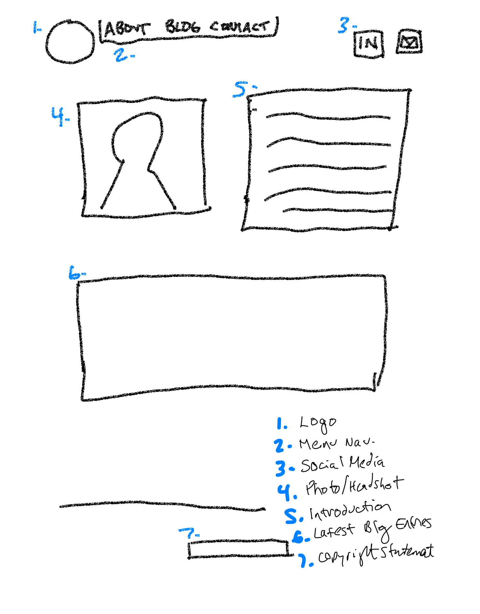
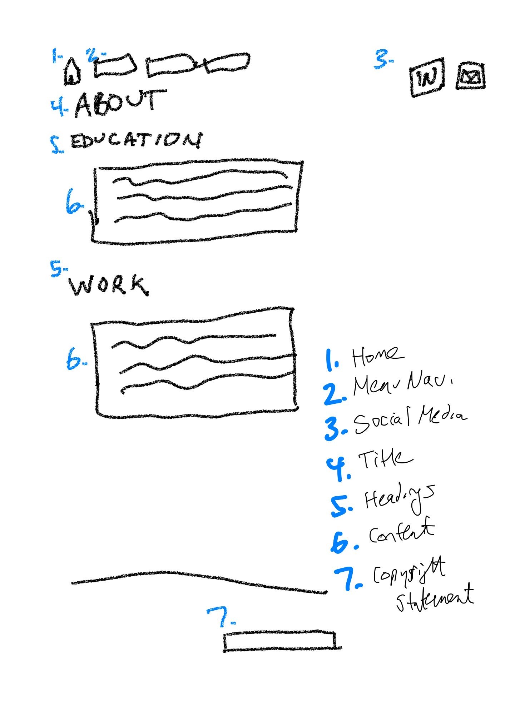
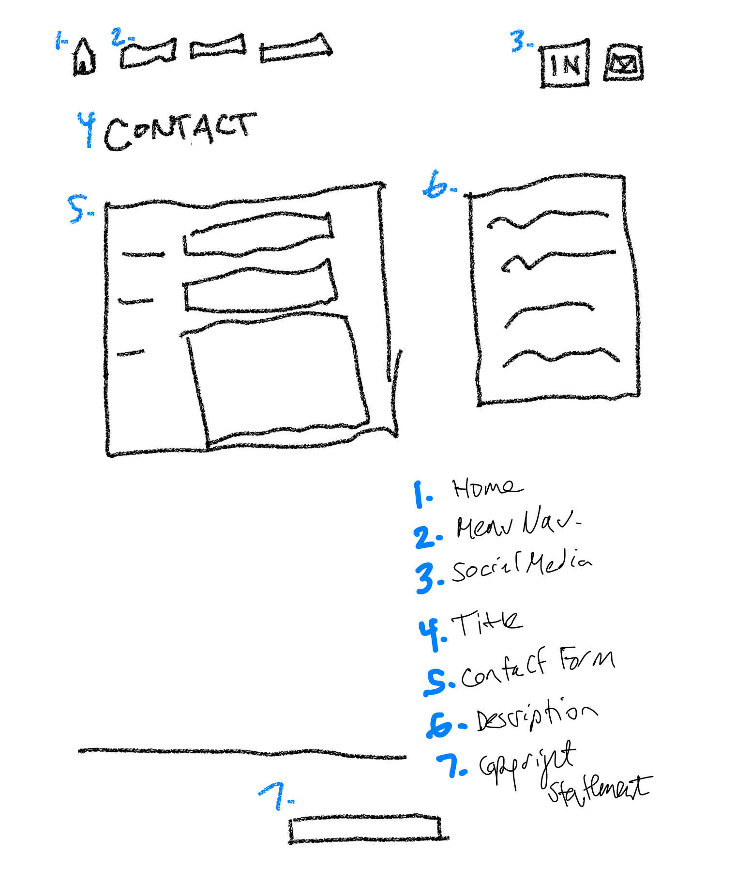

# Matthew Blacquiere's INF6420 Project

A portfolio site showcasing my work, experience and interests. 

## Wireframes
The following wireframes will show how the site architecture and layout might look.

### Home Page

Header - will include a site logo, navigation menu and social media links

Navigation Menu - will include links to other pages such as About and Contact

Main Content - here I include a photo/headshot and give a brief introduction to my portfolio site. There will also be a section below that includes the latest blog entry and/or recent content added to the site

Footer -  this will include copyright information

### About Page

Header - will include link to home page, navigation menu and social media links

Main Content - this area will include headings for Education, Work and Interests

Footer -  this will include copyright information

### Contact Page

Header - will include link to home page, navigation menu and social media links

Main Content - this area will feature a contact form with fields for Name, Email and Message. On the right side will be a short description about getting in contact.

Footer -  this will include copyright information
